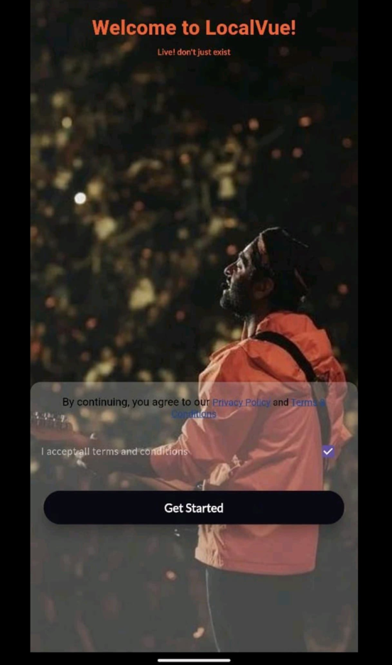
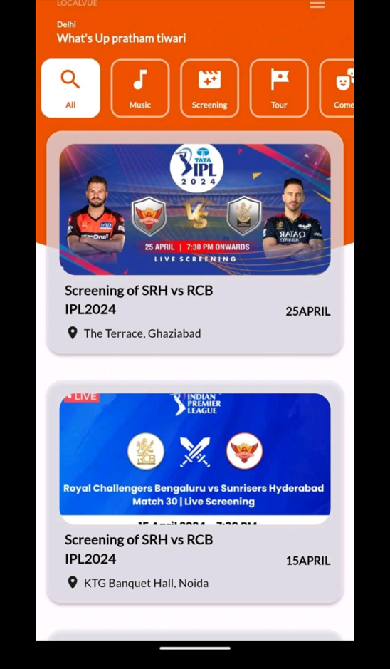

<h1 align="center">
  LocalVue 📍
</h1>

<p align="center">
  
  
  
  
</p>

<p align="center">
  A Flutter-based app providing a local onboarding and navigation experience, ready for authentication and dynamic feature integrations.
</p>

---

## 🚀 Features

- 📱 Onboarding experience
- ✅ Terms and Conditions validation
- 🏠 Conditional navigation to Homepage
- 🔐 Future-ready for Authentication (AWS Cognito / Firebase)
- 🌐 Local-first user experience

---


## 📊 App Flow Diagram

```mermaid
graph TD
    A[App Launch] --> B[Onboarding Screen]
    B --> C[Accept T&C Checkbox]
    C --> D{Authenticated?}
    D -- Yes --> E[Go to HomePage]
    D -- No --> F[Redirect to Login or Signup (Future)]
```

---

## 📁 Folder Structure

```bash
localvue/
├── android/                # Android project config
├── ios/                    # iOS project config
├── lib/
│   ├── onboarding/         # Onboarding UI/logic
│   ├── homepage/           # Post-login homepage
│   ├── auth/               # (Planned) Authentication logic
│   └── main.dart           # App entry point
├── pubspec.yaml            # Project metadata & dependencies
└── README.md               # Documentation
```

---

## 🛠️ Installation

```bash
git clone https://github.com/Singhadi27/localvue.git
cd localvue
flutter pub get
flutter run
```

> Ensure you have Flutter installed and set up on your local machine.

---

## 📲 Usage

- Launch the app
- Onboarding screen with Terms and Conditions
- Once accepted, redirect to homepage
- Add login/signup integration for full authentication flow

---

## 📦 Tech Stack

- **Flutter** + **Dart**
- Material UI
- Android/iOS support

---

## 🤝 Contributing

1. Fork the repository
2. Create your feature branch (`git checkout -b feature/AmazingFeature`)
3. Commit your changes (`git commit -m 'Add some AmazingFeature'`)
4. Push to the branch (`git push origin feature/AmazingFeature`)
5. Open a pull request

---

## 🪪 License

This project is licensed under the MIT License - see the [LICENSE](LICENSE) file for details.

---

## 📸 Screenshots





---

## 🙌 Acknowledgements

Inspired by the need for scalable, cloud-ready Flutter apps.
